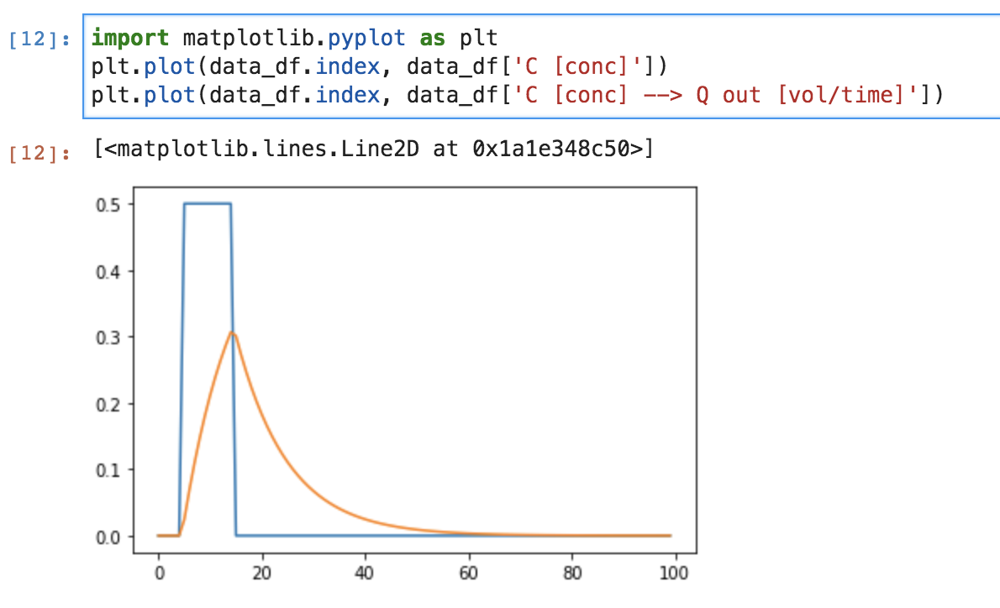

==========
Quickstart
==========

To run a mesas.py model, you must supply four things.

The first is a timeseries of the system inputs and outputs, and of any time-varying parameters, stored in either 

   - a `Pandas <https://pandas.pydata.org/>`_ dataframe
   - a ``.csv`` file
  
The other three are sets of parameters and options to configure the model, which can be supplied either as text files (in the human-readable JSON format) or as python dictionaries (``dict`` objects). The three sets are

 - A specification of the SAS function
 - A specification of any solute solute_parameters
 - Any optional parameters and settings

If you are unfamiliar with ``pandas`` and python ``dict`` objects (or even if you are) it is probably easiest to start by using ``.csv`` and ``.json`` input files.

Input timeseries
================

The ``.csv`` of timeseries data should contain (at minimum) the timeseries of fluid input, output, and any tracer input timeseries. In addition, many SAS function and solute parameters can be time-varying (rather than fixed values). When they vary in time, they must be provided as a column in the dataframe.

The code below creates a ``.csv`` file with some artificial data. We will construct it to be 100 timesteps of steady flow at rate ``Q_steady`` through storage volume ``Storage_vol``. The inputs will be labeled with tracer at concentration ``C_tracer_input`` for 10% of the total duration near the start of the timeseries. Let's start by creating some variables to hold this information::

    timeseries_duration = 1.
    timeseries_length = 100
    dt = timeseries_duration/timeseries_length

    pulse_start = 0.05
    pulse_end = 0.15

    C_tracer_input = 0.5
    Q_steady = 1.
    Storage_vol = 0.1

Now we will create the dataframe in pandas::

    import pandas as pd
    import numpy as np
    data_df = pd.DataFrame(index=np.arange(timeseries_length) * dt)
    data_df['Q out [vol/time]'] = Q_steady
    data_df['J in [vol/time]'] = Q_steady
    data_df['C [conc]'] = 0
    data_df.loc[pulse_start:pulse_end, 'C [conc]'] = C_tracer_input
    data_df.to_csv('data.csv')

This creates a file ``data.csv`` that contains the input timeseries.

Configuration information
=========================

Next, let's give the specifications of the SAS function, solute parameters, and options in a file ``config.json``. The part specifying the SAS function looks like this::

    "sas_specs": {
        "Q out [vol/time]": {
            "my first SAS func!": {
                "ST": [0, "Storage_vol"]
                }
            }
        }

This specification says the following:

- There is only one flux out, and it can be found under the column ``"Q out [vol/time]"`` in the dataframe.
- There is only one SAS function associated with this flux, and it is called ``"my first SAS func!"``.
- The SAS function is specified as a piecewise linear function with one linear segment from :math:`P=0` at :math:`ST=0` to :math:`P=1` at :math:`ST =` ``Storage_vol``.

The only solute information we need to give is the name of the column containing the input timeseries. The part of the ``config.json`` file providing this information looks like this::

    "solute_parameters": {
        "C [conc]": {}
        }

The dictionary associated with our solute is empty ``{}``, so the default parameters will be used.

The part providing additional options looks like this::

    "options":{
        "dt": 0.01,
        "influx": "J in [vol/time]"
        }

This specifies

- The timestep of the model ``dt`` (which depends on the units of the inflow and outflow)
- The name of the column in the dataframe that contains the inflow rate, given by the keyword argument ``influx``

The complete ``config.json`` file should look like this:

.. code-block:: json

    {

    "sas_specs": {
        "Q out [vol/time]": {
            "my first SAS func!": {
                "ST": [0, "Storage_vol"]
                }
            }
        },

    "solute_parameters": {
        "C [conc]": {}
        },
        
    "options":{
        "dt": 0.01,
        "influx": "J in [vol/time]"
        }   

    }

Running mesas.py
================

Now we are ready to import mesas.py, create the model, and run it::

    from mesas.sas.model import Model
    model = Model(data_df='data.csv', config='config.json')
    model.run()
    model.data_df.to_csv('data_with_results.csv')

Assuming the model runs without incident the predicted discharge concentration has appeared as a new column in the file ``data_with_results.csv``. The columns generated by the model will have the form ``'<solute column name> --> <flux column name>'``.

Plot the results
================

The results can be accessed within python as the ``pandas`` dataframe ``model.data_df``

We can use matplotlib to plot individual columns of the dataframe like this::

    import matplotlib.pyplot as plt
    plt.plot(model.data_df.index, model.ata_df['C [conc]'])
    plt.plot(model.data_df.index, model.data_df['C [conc] --> Q out [vol/time]'])

Which should give this:

